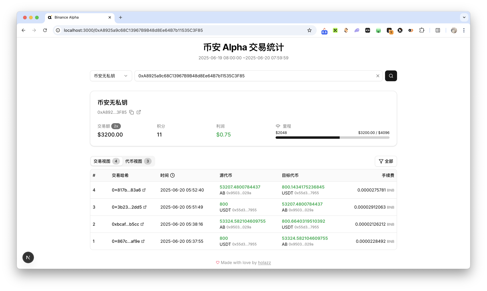

# Binance Alpha 交易统计

追踪和分析 [Binance Alpha](https://www.binance.com/zh-CN/alpha) 代币交易数据。支持多钱包管理、交易记录查看、积分计算和利润分析。

## 功能特性

- **多钱包管理** — 支持添加、切换和管理多个 BSC 钱包地址
- **交易统计面板** — 展示交易额、积分、利润和里程碑进度
- **交易视图** — 以表格形式查看所有 Alpha 代币的买入/卖出交易记录
- **代币视图** — 按代币分组查看交易汇总
- **交易筛选** — 支持按买入/卖出/全部筛选，显示或隐藏失败交易
- **自动积分计算** — 根据 Binance Alpha 规则自动计算交易积分

## License

[MIT](LICENSE)
